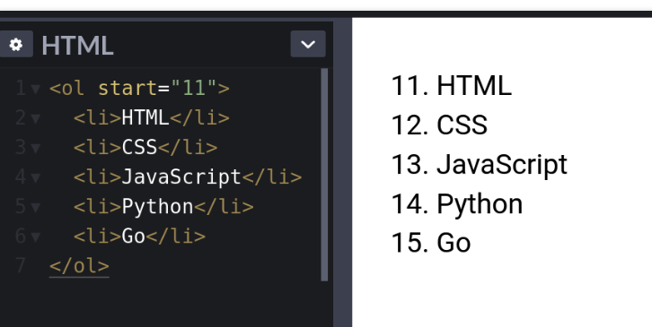
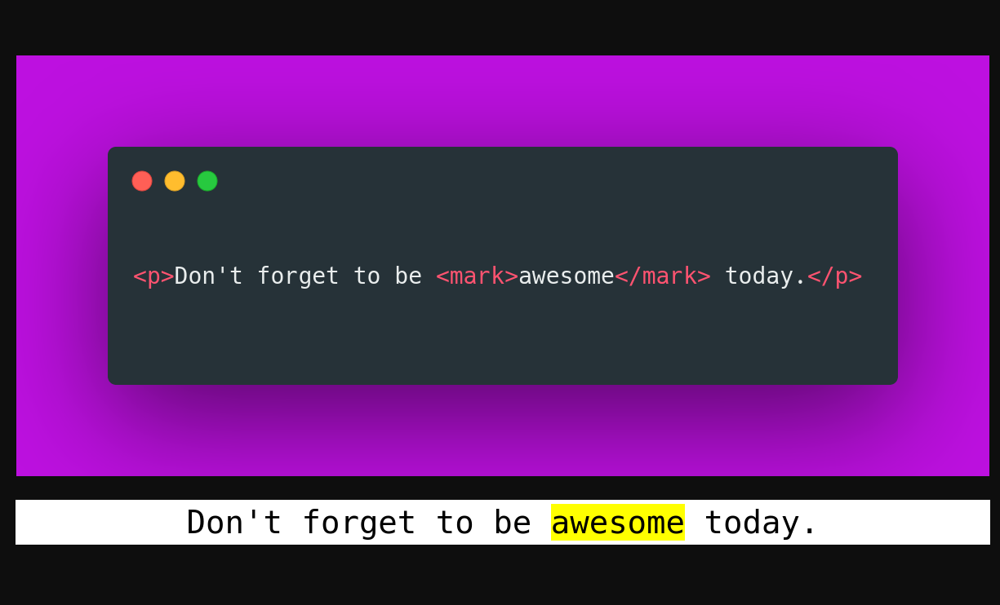

# HTML-基础

## Doctype 声明

`<!DOCTYPE>`声明不是 HTML 标签, 位于 HTML 文件第一行, 用来指示浏览器关于页面使用哪个 HTML 版本进行编写的指令.

HTML4.01 声明引用[DTD](https://www.w3school.com.cn/dtd/index.asp), 因为 HTML4.01 基于[SGML](https://wiki.mbalib.com/wiki/SGML)

HTML5 不基于 SGML, 所以不需要引用 DTD.

```html
<!DOCTYPE html>
```

HTML4.01 有三种声明方式:

-   HTML4.01 Strict: 该 DTD 包含所有 HTML 元素和属性，但不包括展示性的和弃用的元素（比如 font）。不允许框架集（Framesets）。

```html
<!DOCTYPE html PUBLIC "-//W3C//DTD HTML 4.01//EN" "http://www.w3.org/TR/html4/strict.dtd">
```

-   HTML4.01 Transitional: 该 DTD 包含所有 HTML 元素和属性，包括展示性的和弃用的元素（比如 font）。不允许框架集（Framesets）。

```html
<!DOCTYPE html PUBLIC "-//W3C//DTD HTML 4.01 Transitional//EN" "http://www.w3.org/TR/html4/loose.dtd">
```

-   HTML4.01 Framset: 该 DTD 等同于 HTML 4.01 Transitional，但允许框架集内容。

```html
<!DOCTYPE html PUBLIC "-//W3C//DTD HTML 4.01 Frameset//EN" "http://www.w3.org/TR/html4/frameset.dtd">
```

### 文档解析模式

文档解析类型有:

-   BackCompat: 怪异模式, 浏览器使用自己的怪异模式解析渲染页面(如果没有 DOCYTYPE, 默认就是这个模式)
-   CSS1Compat: 标准模式, 浏览器使用 W3C 的标准解析渲染页面.
-   IE8 之前(包含)还有一种近乎标准模式, 现在基本淘汰.

这三种模式的区别:

-   标准模式(standards mode): 页面按照 HTML 与 CSS 的定义渲染
-   怪异模式(quirks mode)模式: 会模拟更旧的浏览器的行为
-   近乎标准(almost standards)模式: 会实施了一种表单元格尺寸的怪异行为（与 IE7 之前的单元格布局方式一致），除此之外符合标准定义

### 获取浏览器解析模式

```js
alert(window.top.document.compatMode);
//BackCompat  表示怪异模式
//CSS1Compat  表示标准模式
```

## HTML, XML 与 XHTML

-   HTML:文本标记语言 (Hyper Text Markup Language), 在 html4.0 之前 HTML 先有实现再有标准，导致 HTML 非常混乱和松散
-   XML: 可扩展标记语言（EXtensible Markup Language）,XML 被设计为传输和存储数据，其焦点是数据的内容。HTML 被设计用来显示数据，其焦点是数据的外观。HTML 旨在显示信息，而 XML 旨在传输信息。
-   XHTML: XHTML 是以 XML 格式编写的 HTML。要求更加严格

### XHTML 与 HTML

-   XHTML DOCTYPE 是强制性的
-   `<html>` 中的 XML namespace 属性是强制性的
-   `<html>`、`<head>`、`<title>` 以及 `<body>` 也是强制性的

-   XHTML 元素必须正确嵌套
-   XHTML 元素必须始终关闭
-   XHTML 元素必须小写
-   XHTML 文档必须有一个根元素

-   XHTML 属性必须使用小写
-   XHTML 属性值必须用引号包围
-   XHTML 属性最小化也是禁止的

## HTML 全局属性

- class: 为元素设置类表示
- data-\*: 为元素增加自定义属性
- draggable: 设置元素是否可以拖拽
- id: 文档内唯一的标识
- lang: 元素内容的语言
- style: 行内css样式
- title: 元素相关的建议信息

## data-\* 属性

```html
<article id="electriccars" data-title="articleTitle" data-index-number="12314" data-parent="cars">
    ...
</article>
```

```js
let article_title = articledom.dataset.title;
```

## HTML 语义化

语义化指使用合理正确的标签来描述网页内容, 对于展示型网站和需要 SEO 的站点来说比较重要. 好处有:

-   易于用户阅读，样式丢失的时候能让页面呈现清晰的结构。
-   有利于 SEO，搜索引擎根据标签来确定上下文和各个关键字的权重。
-   方便其他设备解析，如盲人阅读器根据语义渲染网页
-   有利于开发和维护，语义化更具可读性，代码更好维护，与 CSS3 关系更和谐

但是对于功能的 web 软件来说, 其重要性就可能要打折扣.

常见的语义化的标签有:

- header: 表示网页或者任意section的头部
- footer: 表示网页或者任意section的尾部
- hgroup: 多个连续标题的时候可以使用
- nav: 表示页面的导航链接区域, 注意是主体导航区域
- aside: 被包含在article元素中作为主要内容的附属信息部分, 其中的内容可以是与当前文章有关的资料, 标签, 名词解释等
- article: 表示文章主体的内容
- address: 表示联系信息模块

## HTML5 与 HTML4 的不同之处

-   文件类型声明（`<!DOCTYPE>`）仅有一型：`<!DOCTYPE HTML>`。
-   新的解析顺序：不再基于 SGML。
-   新的元素：section, video, progress, nav, meter, time, aside, canvas, command, datalist, details, embed, figcaption, figure, footer, header, hgroup, keygen, mark, output, rp, rt, ruby, source, summary, wbr。
-   input 元素的新类型：date, email, url 等等。
-   新的属性：ping（用于 a 与 area）, charset（用于 meta）, async（用于 script）。
-   全域属性：id, tabindex, repeat。
-   新的全域属性：contenteditable, contextmenu, draggable, dropzone, hidden, spellcheck。
-   移除元素：acronym, applet, basefont, big, center, dir, font, frame, frameset, isindex, noframes, strike, tt

## meta 标签

`<meta>` 元素可提供有关页面的元信息（meta-information），比如针对搜索引擎和更新频度的描述和关键词。

`<meta>` 标签位于文档的头部，不包含任何内容。`<meta>` 标签的属性定义了与文档相关联的名称/值对。

-   `charset`: 用于描述 HTML 文档的编码形式

```html
<meta charset="UTF-8" />
```

-   `http-equiv`: 相当于 http 的文件头作用,比如下面的代码就可以设置 http 的缓存过期日期

```html
<meta http-equiv="expires" content="Wed, 20 Jun 2019 22:33:00 GMT" />
```

-   `viewport`: Web 开发人员可以控制视口的大小和比例

```html
<meta name="viewport" content="width=device-width, initial-scale=1, maximum-scale=1" />
```

具体的设置属性:

-   width ： 设置 viewport 的宽度，默认视口宽度
-   height： 设置 viewport 的高度
-   initial-scale ： 设置页面的初始缩放值
-   minimum-scale ：允许用户的最小缩放值
-   maximum-scale：允许用户的最大缩放值
-   user-scalable： 是否允许用户进行缩放，值为"no"或"yes", no 代表不允许，yes 代表允许

-   `apple-mobile-web-app-status-bar-style`: 为了自定义苹果工具栏的颜色

```html
<meta name="apple-mobile-web-app-status-bar-style" content="black-translucent" />
```

相关的meta设置:

```html
<!DOCTYPE html> <!--H5标准声明，使用 HTML5 doctype，不区分大小写-->
<head lang=”en”> <!--标准的 lang 属性写法-->
<meta charset=’utf-8′> <!--声明文档使用的字符编码-->
<meta http-equiv=”X-UA-Compatible” content=”IE=edge,chrome=1″/> <!--优先使用指定浏览器使用特定的文档模式-->
<meta name=”description” content=”不超过150个字符”/> <!--页面描述-->
<meta name=”keywords” content=””/> <!-- 页面关键词-->
<meta name=”author” content=”name, email@gmail.com”/> <!--网页作者-->
<meta name=”robots” content=”index,follow”/> <!--搜索引擎抓取-->
<meta name=”viewport” content="maximum-scale=3, minimum-scale=1">
<meta name=”apple-mobile-web-app-title” content=”标题”> <!--iOS 设备 begin-->
<meta name=”apple-mobile-web-app-capable” content=”yes”/> <!--添加到主屏后的标
是否启用 WebApp 全屏模式，删除苹果默认的工具栏和菜单栏-->
<meta name=”apple-mobile-web-app-status-bar-style” content=”black”/>
<meta name=”renderer” content=”webkit”> <!-- 启用360浏览器的极速模式(webkit)-->
<meta http-equiv=”X-UA-Compatible” content=”IE=edge”> <!--避免IE使用兼容模式-->
<meta http-equiv=”Cache-Control” content=”no-siteapp” /> <!--不让百度转码-->
<meta name=”HandheldFriendly” content=”true”> <!--针对手持设备优化，主要是针对一些老的不识别viewport的浏览器-->
<meta name=”MobileOptimized” content=”320″> <!--微软的老式浏览器-->
<meta name=”screen-orientation” content=”portrait”> <!--uc强制竖屏-->
<meta name=”x5-orientation” content=”portrait”> <!--QQ强制竖屏-->
<meta name=”full-screen” content=”yes”> <!--UC强制全屏-->
<meta name=”x5-fullscreen” content=”true”> <!--QQ强制全屏-->
<meta name=”browsermode” content=”application”> <!--UC应用模式-->
<meta name=”x5-page-mode” content=”app”> <!-- QQ应用模式-->
<meta name=”msapplication-tap-highlight” content=”no”> <!--windows phone
设置页面不缓存-->
<meta http-equiv=”pragma” content=”no-cache”>
<meta http-equiv=”cache-control” content=”no-cache”>
<meta http-equiv=”expires” content=”0″>
```

## src 与 href 的区别

-   src 是指向外部资源的位置，指向的内容会嵌入到文档中当前标签所在的位置，在请求 src 资源时会将其指向的资源下载并应用到文档内，如 js 脚本，img 图片和 frame 等元素。当浏览器解析到该元素时，会暂停其他资源的下载和处理，直到将该资源加载、编译、执行完毕，所以一般 js 脚本会放在底部而不是头部。
-   href 是指向网络资源所在位置（的超链接），用来建立和当前元素或文档之间的连接，当浏览器识别到它他指向的文件时，就会并行下载资源，不会停止对当前文档的处理。


## title 和 alt 的区别

- 两个属性都是当鼠标滑动到元素上的时候显示
- `alt`是`img`的特有属性, 是图片内容的等价描述, 图片无法正常显示的时候的代替文字
- `title`是可以用在除了`base`,`basefont`,`head`,`html`,`meta`,`param`, `script`和`title`之外的所有标签, 是对DOM元素的一种类似注释说明.

## img-srcset: 响应式图片

```html

```

srcset 定义了我们允许浏览器选择的图像集，以及每个图像的大小。在每个逗号之前，我们写：

-   一个文件名 (elva-fairy-480w.jpg.)
-   一个空格
-   图像的固有宽度（以像素为单位）（480w）——注意到这里使用 w 单位，而不是你预计的 px。这是图像的真实大小，可以通过检查你电脑上的图片文件找到。

sizes 定义了一组媒体条件（例如屏幕宽度）并且指明当某些媒体条件为真时，什么样的图片尺寸是最佳选择—我们在之前已经讨论了一些提示。在这种情况下，在每个逗号之前，我们写：

-   一个媒体条件（(max-width:480px)）——你会在 CSS topic 中学到更多的。但是现在我们仅仅讨论的是媒体条件描述了屏幕可能处于的状态。在这里，我们说“当可视窗口的宽度是 480 像素或更少”。
-   一个空格
-   当媒体条件为真时，图像将填充的槽的宽度（440px）

所以，有了这些属性，浏览器会：

1. 查看设备宽度
2. 检查 sizes 列表中哪个媒体条件是第一个为真
3. 查看给予该媒体查询的槽大小
4. 加载 srcset 列表中引用的最接近所选的槽大小的图像

## picture: 响应式图片 2

```html
<picture>
    <source media="(max-width: 799px)" srcset="elva-480w-close-portrait.jpg" />
    <source media="(min-width: 800px)" srcset="elva-800w.jpg" />
    
</picture>
```

-   `<source>`元素包含一个 media 属性，这一属性包含一个媒体条件——就像第一个 srcset 例子，这些条件来决定哪张图片会显示——第一个条件返回真，那么就会显示这张图片。在这种情况下，如果视窗的宽度为 799px 或更少，第一个`<source>`元素的图片就会显示。如果视窗的宽度是 800px 或更大，就显示第二张图片。
-   srcset 属性包含要显示图片的路径。请注意，正如我们在``上面看到的那样，`<source>`可以使用引用多个图像的 srcset 属性，还有 sizes 属性。所以你可以通过一个 `<picture>`元素提供多个图片，不过也可以给每个图片提供多分辨率的图片。实际上，你可能不想经常做这样的事情。
-   在任何情况下，你都必须在 `</picture>`之前正确提供一个``元素以及它的 src 和 alt 属性，否则不会有图片显示。当媒体条件都不返回真的时候（你可以在这个例子中删除第二个`<source>` 元素），它会提供图片；如果浏览器不支持 `<picture>`元素时，它可以作为后备方案。

## script: defer/async

-   defer：浏览器指示脚本在文档被解析后执行，script 被异步加载后并**不会立刻执行**，而是等待文档被解析完毕后执行。
-   async：同样是异步加载脚本，区别是脚本加载完毕后**立即执行**，这导致 async 属性下的脚本是乱序的，对于 script 有先后依赖关系的情况，并不适用。


## `dns-prefetch`, `preconnect`,`prefetch`,`prerender`的区别

### `dns-prefetch`

`dns-prefetch`是一项使浏览器主动去执行域名解析的功能

```html
<link rel="dns-prefetch" href="//example.com" />
```

href 属性值就是需要 dns 与解析的 host

### `preconnect`

浏览器需要建立一个连接, 一般需要经过 DNS 查找, TCP 三次握手和 TLS 协商(如果是 https 的话), 这些过程都是需要耗时的, preconnect 就是使浏览器预先建立一个连接, 等真正需要加载资源的时候就能够直接请求了.

```html
<link rel="preconnect" href="//example.com" /> <link rel="preconnect" href="//cdn.example.com" crossorigin />
```

对于这两个标签, 浏览会进行以下步骤:

1. 解释 href 的值, 如果是合法的 URL, 继续判断 URL 的协议是否是 http 或者 https, 否则就结束处理.
2. 如果当前页面的 host 不同于 href 中的 host, crossorigin 其实就被设置为 anonymous(不带 cookie), 如果希望带上 cookie 等信息, 可以加上那个 crossorigin, crossorigin 就等同于设置为`use-credentials`.

### `prefetch`

能够让浏览器预加载一个资源(HTML, JS, CSS 或者图片等), 可以让用户跳转到其他页面时, 响应速度更快

```js
<link rel="prefetch" href="//example.com/next-page.html" as="html" crossorigin="use-credentials">
<link rel="prefetch" href="/library.js" as="script">
```

在这个模式下, 资源被预加载了, 但是不会解析或者 JS 不会执行

### `prerender`

`prerender`不同于`prefetch`, 不仅会预加载资源, 还会解析执行页面, 进行预渲染, 但这会根据浏览器自身进行判断, 浏览器根据不同的情况,有几种选择:

-   分配少量资源对页面进行预渲染
-   挂起部分请求之知道页面可见
-   可能会放弃预渲染, 如果资源消耗过多
-   ...

```js
<link rel="prerender" href="//example.com/next-page.html">
```

## `pr`

这几个属性都支持`pr`属性, 取值在 0.0~1.0 范围中, 能够让浏览器判断优先加载哪些资源.

## integrity/crossorigin: 跨域资源以及 SRI

-   crossorigin: 引入跨域的脚本（比如用了 apis.google.com 上的库文件），如果这个脚本有错误，因为浏览器的限制（根本原因是协议的规定），是拿不到错误信息的。当本地尝试使用 window.onerror 去记录脚本的错误时，跨域脚本的错误只会返回 Script error。但 HTML5 新的规定，是可以允许本地获取到跨域脚本的错误信息，但有两个条件：一是跨域脚本的服务器必须通过 Access-Controll-Allow-Origin 头信息允许当前域名可以获取错误信息，二是当前域名的 script 标签也必须指明 src 属性指定的地址是支持跨域的地址，也就是 crossorigin 属性。
-   integrity:启用子资源完整性校验 SRI 策略, 通过提供的 hash 值校验文件是否完整, 目前支持的浏览器为 chrome45+和 FireFox43+, 支持`sha256`、`sha384` 和 `sha512`, 签名算法和摘要签名内容用`-`分隔.

```html
<link
    crossorigin="anonymous"
    href="https://assets-cdn.github.com/assets/github-aef3088517c60128e10c5cce8d392985504018745a58a13691f1a278951852bb.css"
    integrity="sha256-rvMIhRfGASjhDFzOjTkphVBAGHRaWKE2kfGieJUYUrs="
    media="all"
    rel="stylesheet"
/>

<script
    crossorigin="anonymous"
    integrity="sha256-+Ec97OckLaaiDVIxNjSIGzl1xSzrqh5sOBV8DyYYVpE="
    src="https://assets-cdn.github.com/assets/frameworks-f8473dece7242da6a20d52313634881b3975c52cebaa1e6c38157c0f26185691.js"
></script>
```

下面是一个例子:

1. 引入资源地址:`https://example.com/static/js/other/zepto.js`
2. 生成签名并进行 Base64 编码:`curl https://example.com/static/js/other/zepto.js | openssl dgst -sha256 -binary | openssl enc -base64 -A`
3. 得到 hash:`b/TAR5GfYbbQ3gWQCA3fxESsvgU4AbP4rZ+qu1d9CuQ=`
4. 嵌入标签: `<script crossorigin="anonymous" integrity="sha256-b/TAR5GfYbbQ3gWQCA3fxESsvgU4AbP4rZ+qu1d9CuQ=" src="https://example.com/static/js/other/zepto.js"></script>`

浏览器在拿到资源之后会使用`integrity`指定的签名算法计算结果, 并与照耀签名比对, 如果不一致, 就不会执行这个资源.

动态加载的资源使用 SRI 也类似的, 需要指定`crossOrigin`和`intergrity`:

```js
var s = document.createElement('script');
s.crossOrigin = 'anonymous';
s.integrity = 'sha256-b/TAR5GfYbbQ3gWQCA3fxESsvgU4AbP4rZ+qu1d9CuQ=';
s.src = 'https://example.com/static/js/other/zepto.js';
document.head.appendChild(s);
```

## querySelector HTML 选择器

### `querySelector`

这是一种更简单的`dom`节点选择器, 可以用类似`jquery`的方式使用比较复杂的查询语句, 比如:

```js
document.querySelector('#nav li:first-child'); // 获取文档中id="nav"下面的第一个li元素
```

与其他`getElement`系列的选择器不同, 它默认只取匹配到的第一个元素.

### `querySelectorAll`

获取指定元素中匹配`css`选择器的所有元素:

```js
let list = document.querySelectorAll('li'); // NodeList(2) [li, li] 这里假设返回2个
```

返回一个类数组, 但是无法使用`filter`,`map`等方法, 可以这样预先处理一下:

```js
Array.from(list).map();
```

### `closest`

跟`querySelect`相反, 该元素可以向上查询, 可以查询到父元素:

```js
document.querySelector('li').closest('#nav');
```

### `dataset`

和原生微信小程序一样, 能够获取标签上以`data-`为前缀的属性的集合:

```js
//html
<p data-name='蜘蛛侠' data-age='16'></p>;
//js
document.querySelector('p').dataset; // {name: "蜘蛛侠", age: "16"}
```

## URLSearchParams

可以简单的获取 URL 参数

```js
new URLSearchParams(location.search).get('name'); // 蜘蛛侠
```

## 常用 html 属性

### hidden

一个 html 属性, 规定元素是否隐藏, 表现为 css 的`display:none`:

```js
//html
<div hidden>我被隐藏了</div>;
//js
document.querySelector('div').hidden = true / false;
```

### contenteditable

可以使一个元素可以被用户编辑：

```js
<p contenteditable>我是P元素，但是我也可以被编辑</p>
```

### spellcheck

规定输入的内容是否检查英文的拼写：

```html
<!-- 默认就是true，可省略 -->
<textarea spellcheck="true"></textarea>
```

设置不检查:

```html
<textarea spellcheck="false"></textarea>
```

### classList

这是一个对象，该对象里封装了许多操作元素类名的方法：

```html
<p class="title"></p>
```

```js
let elem = document.querySelector('p');

// 增加类名
elem.classList.add('title-new'); // "title title-new"

// 删除类名
elem.classList.remove('title'); // "title-new"

// 切换类名（有则删、无则增，常用于一些切换操作，如显示/隐藏）
elem.classList.toggle('title'); // "title-new title"

// 替换类名
elem.classList.replace('title', 'title-old'); // "title-new title-old"

// 是否包含指定类名
elem.classList.contains('title'); // false
```

### getBoundingClientRect

可以获取指定元素在当前页面的空间信息：

```js
elem.getBoundingClientRect();

// 返回
{
  x: 604.875,
  y: 1312,
  width: 701.625,
  height: 31,
  top: 1312,
  right: 1306.5,
  bottom: 1343,
  left: 604.875
}
```

### contains

可以判断指定元素是否包含了指定的子元素：

```html
<div>
    <p></p>
</div>
```

```js
document.querySelector('div').contains(document.querySelector('p')); // true
```

### toDataURL

这个 canvas 的 API，作用是将画布的内容转换成一个 base64 的图片地址；

```js
let canvas = document.querySelector("canvas");
let context = canvas.getContext("2d");

// 画东西
...

let url = canvas.toDataURL("image/png"); // 将画布内容转换成base64地址
```

使用 a 标签进行图片下载时，图片链接跨域（图片是我的掘金头像），无法进行下载而是进行图片预览：

```html


<button>
    <a href="xxx" download="avatar">下载图片</a>
</button>
```

可以进行如下封装来解决这个问题:

```js
const downloadImage = (url, name) => {
    // 实例化画布
    let canvas = document.createElement('canvas');
    let context = canvas.getContext('2d');

    // 实例化一个图片对象
    let image = new Image();
    image.crossOrigin = 'Anonymous';
    image.src = url;

    // 当图片加载完毕
    image.onload = () => {
        // 将图片画在画布上
        canvas.height = image.height;
        canvas.width = image.width;
        context.drawImage(image, 0, 0);

        // 将画布的内容转换成base64地址
        let dataURL = canvas.toDataURL('image/png');

        // 创建a标签模拟点击进行下载
        let a = document.createElement('a');
        a.hidden = true;
        a.href = dataURL;
        a.download = name;

        document.body.appendChild(a);
        a.click();
    };
};
```

### customEvent

自定义事件，就跟 vue 里面的 on 跟 emit 一样；

```js
window.addEventListener('follow', event => {
    console.log(event.detail); // 输出 {name: "前端宇宙情报局"}
});
```

派发自定义事件：

```js
window.dispatchEvent(
    new CustomEvent('follow', {
        detail: {
            name: '前端宇宙情报局'
        }
    })
);
```

## DOM的事件流

事件流是网页元素接受事件的顺序, 包括三个阶段: 

- 事件捕获阶段: Capture, 事件从最顶层的window一直传递到目标元素的父元素
- 处于目标阶段:target, 事件到达目标元素, 如果事件指定不冒泡, 那就回在这里终止
- 事件冒泡阶段: Bubble, 事件从目标元素父元素向上逐级传递到最顶层元素window. 即捕获的反方向.

首先发生的事件捕获, 为截获事件提供机会. 然后是实际的目标接受事件, 最后一个阶段是事件冒泡阶段, 可以在这个阶段对事件作出响应. 虽然捕获阶段在规范中规定不允许响应事件, 但是实际上还是会执行, 所以有两次机会获取到目标对象. 

要决定事件是在捕获阶段生效还是冒泡阶段生效, 可以通过`addEventListener`参数的第三个方法决定.

```js
target.addEventListener(type, listener[, options]);
target.addEventListener(type, listener[, useCapture]);
target.addEventListener(type, listener[, useCapture, wantsUntrusted  ]);  // Gecko/Mozilla only
```

- type: 表示监听事件类型的字符串: [事件列表](https://developer.mozilla.org/zh-CN/docs/Web/Events)
- listener: 当前监听事件类型触发时的回调, 会接收到一个事件通知对象
- options: 可选, 可用选项如下:
  - capture: boolean, 如果为 true, 表示在捕获阶段触发, 如果是false, 在冒泡阶段触发
  - once: boolean, 如果是 true, 表示listener在添加之后最多只调用一次
  - passive: boolean, 如果是, 表示listener永远不会调用`preventDefault()`. 如果调用了, 客户端会忽略它并抛出一个控制台警告.
- useCapture: 可选, 同 capture

### 事件的实现

DOM的事件是基于发布订阅模式, 就是在浏览器加载的时候会读取事件相关的代码, 但是只有实际等到具体的事件触发的时候才会执行.

比如点击按钮, 这是个事件(Event), 而负责处理事件的代码通常被称为事件处理程序(Event Handler)

在Web端, 我们常见的就是DOM事件:

- DOM 0 事件, 直接在html元素上绑定`on-event`, 比如`onclick`, 取消的话设置为`null`, 同一个事件只能有一个处理程序
- DOM 2 事件, 通过`addEventListener`注册事件, 通过`removeEventListener`来删除事件, 一个事件可以有多个事件处理程序
- DOM 3 事件, 增加了更多的事件类型, 比如UI事件, 焦点事件等等

更细节的使用参考这里: [事件模型](https://javascript.ruanyifeng.com/dom/event.html)

### target、currentTarget的区别？

- currentTarget当前所绑定事件的元素
- target当前被点击的元素

## fetch 和 ajax 的区别

- 当接收到一个代表错误的HTTP状态码是, 从`fetch()`返回的`promise`不会被标记为reject, 即使响应的HTTP状态码是404或者500. 相反, 它会将Promise的状态标记为resolve(但是会把resolve 的返回值的`OK`属性设置为`false`), 仅当网络故障或者请求被阻止的时候, 才会标记为reject
- `fetch`可以接受跨域的cookies, 可以使用`fetch`建立跨域会话
- `fetch`不会发送`cookies`, 处理使用了`credentials`的初始化选项. 

## 如何中断ajax的请求

- 设置ajax的超时时间
- 手动调用XML对象的abort方法: `ajax.abort()`, 停止ajax的请求.

## `window.addEventListener(‘error’)`与`window.onerror`的区别

- 前者能够捕获到资源加载错误, 后者不可以
- 两者都可以捕获js运行时错误, 捕获到的错误参数不同. 前者参数为一个event对象; 后者为msg, url, lineNo, columnNo, error一系列参数, event对象中都含有后者参数的信息

注意:

1. window上的error事件代理, 过滤window本省的error; 根据标签类型判断资源类型, src或者href为资源地址; 为了捕获跨域js的错误, 需要在相应的资源标签上添加`crossorigin`属性
2. addEventListener的第三个参数一定要是`true`, 表示在捕获阶段触发, 如果改为`false`, 就获取不到错误事件了. 

## 一些HTML小技巧

### `loading=lazy`

```html
 
```

### `Email, call, and SMS links`

```html
<a href="mailto:{email}?subject={subject}&body={content}">
  Send us an email
</a>

<a href="tel:{phone}">
  Call us
</a>

<a href="sms:{phone}?body={content}">
  Send us a message
</a>           
    
```

### 指定序列开始start



### 使用meter元素

可以使用meter元素限时一个进度条, 而不需要用js/css代码.

```html
<label for="value1">Low</label>
<meter id="value1" min="0" max="100" low="30" high="75" optimum="80" value="25"></meter>

<label for="value2">Medium</label>
<meter id="value2" min="0" max="100" low="30" high="75" optimum="80" value="50"></meter>

<label for="value3">High</label>
<meter id="value3" min="0" max="100" low="30" high="75" optimum="80" value="80"></meter>
```

### 原生搜索组件

```html
<div class="wrapper">
  <h1>
    Native HTML Search
  </h1>
  
  <input list="items">
  
  <datalist id="items">
    <option value="Marko Denic">
    <option value="FreeCodeCamp">
    <option value="FreeCodeTools">
    <option value="Web Development">
    <option value="Web Developer">
  </datalist>
</div>
```

### 原生的字段元素

```html
<form>
  <fieldset>
    <legend>Choose your favorite language</legend>

    <input type="radio" id="javascript" name="language">
    <label for="javascript">JavaScript</label><br/>

    <input type="radio" id="python" name="language">
    <label for="python">Python</label><br/>

    <input type="radio" id="java" name="language">
    <label for="java">Java</label>
  </fieldset>
</form>
```

### Opener

```html
<a href="https://markodenic.com/" target="_blank" rel="noopener">
	Marko's website
</a>           
```

### 批量控制a标签的打开方式

```html
<head>
   <base target="_blank">
</head>
<!-- This link will open in a new tab. -->
<div class="wrapper">
  This link will be opened in a new tab: &nbsp;
  <a href="https://freecodetools.org/">
    Free Code Tools
  </a>

  <p>
    Read more: <br><a href="https://developer.mozilla.org/en-US/docs/Web/HTML/Element/base">
    MDN Documentation
    </a>
  </p>
</div>
```

### 标签的缓存刷新

```html
<link rel="icon" href="/favicon.ico?v=2" />  
```

用`?v=2`可以更新标签

### `spellcheck`检查拼写错误

```html
<label for="input1">spellcheck="true"</label>
<input type="text" id="input1" spellcheck="true">

<label for="input2">spellcheck="false"</label>
<input type="text" id="input2" spellcheck="false">
```

### 原生滑动条

```html
<label for="volume">Volume: </label>
<input type="range" id="volume" name="volume" min="0" max="20">
```

### 原生展示更多细节

```html
<div class="wrapper">
  <details>
    <summary>
      Click me to see more details
    </summary>

    <p>
      Lorem ipsum dolor sit amet consectetur adipisicing elit. Ut eum perferendis eius. Adipisci velit et similique earum quas illo odio rerum optio, quis, expedita assumenda enim dicta aliquam porro maxime minima sed a ullam, aspernatur corporis.
    </p>
  </details>
</div>
```

### `mark`标签

高亮文本:



### `download`下载文件

```html
<a href='path/to/file' download>
  Download
</a>        
```

### 图片性能优化

```html
<picture>
  <!-- load .webp image if supported -->
  <source srcset="logo.webp" type="image/webp">
  
  <!-- 
	Fallback if `.webp` images or <picture> tag 
	not supported by the browser.
  -->
  
</picture>       
```

### poster: 用于在下载或者播放前显示的视频封面

```html
<video poster="path/to/image">     
```


## 参考链接

-   [前端面试与进阶指南](http://www.cxymsg.com/guide/htmlBasic.html#doctype%E7%9A%84%E4%BD%9C%E7%94%A8%E6%98%AF%E4%BB%80%E4%B9%88%EF%BC%9F%E2%9C%A8)
-   [HTML <!DOCTYPE> 标签](https://www.w3school.com.cn/tags/tag_doctype.asp)
-   [浏览器解析模式](https://www.cnblogs.com/waitingforbb/p/7077541.html)
-   [HTML5 与 HTML4 的区别](https://www.cnblogs.com/melbourne1102/p/6361323.html)
-   [meta viewport 移动端自适应](https://www.jianshu.com/p/561357d7cd7b)
-   [响应式图片-MDN](https://developer.mozilla.org/zh-CN/docs/Learn/HTML/Multimedia_and_embedding/Responsive_images)
-   [张鑫旭-srcset 释义](https://www.zhangxinxu.com/wordpress/2014/10/responsive-images-srcset-size-w-descriptor/)
-   [Head 标签里面的 dns-prefetch，preconnect，prefetch 和 prerender](https://segmentfault.com/a/1190000011065339)
-   [Subresource Integrity 介绍](https://imququ.com/post/subresource-integrity.html)
-   [这些 Web API 真的有用吗? 别问，问就是有用](https://juejin.im/post/5d5df391e51d453b1e478ad0)
-   [DOM 事件流](https://www.jianshu.com/p/6512139d1d9e)
-   [使用fetch](https://developer.mozilla.org/zh-CN/docs/Web/API/Fetch_API/Using_Fetch)
-   [HTML Tips](https://markodenic.com/html-tips/)